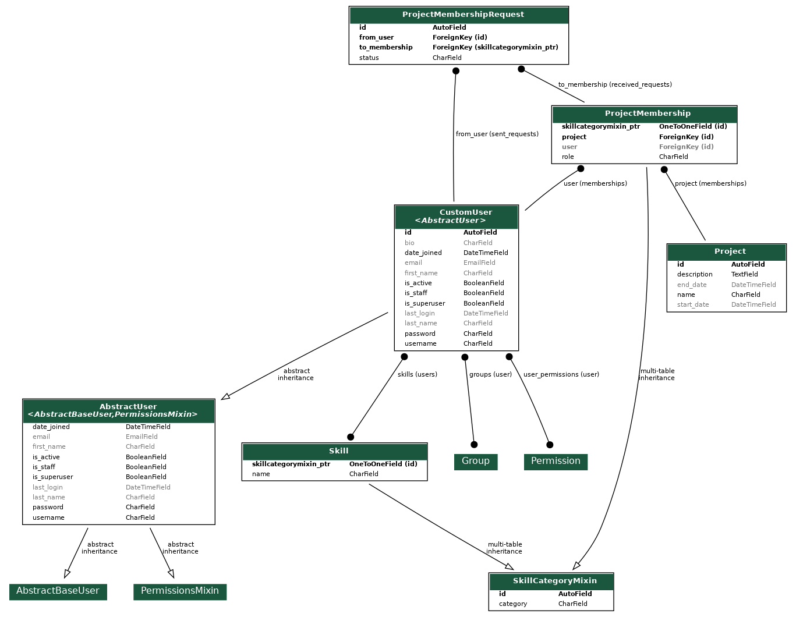

## *teamfinderr* 
A network for skilled individuals looking to start collaborating on projects, helping ideas become reality. Whether you're a self-starter or looking to get involved in a project for your portfolio, ***teamfinderr*** provides a skill-based pairing system to meet your needs.

### Key Features

- Authentication
- Create profile
- Create projects
- Join project teams and be assigned to roles
- Search for users and projects
- Documentation

### Setup Locally

1. [Clone the repository locally.](https://docs.github.com/en/free-pro-team@latest/github/creating-cloning-and-archiving-repositories/cloning-a-repository)

2. Set up all necessary dependencies:
 ```sh
    python -m venv .env
    source .env/bin/activate or .env/Scripts/activate
    pip install -r requirements.txt
 ```

3. Set environment variables:
```sh
   export DJANGO_SECRET_KEY='secret' or $env:DJANGO_SECRET_KEY='secret'
```

4. Apply all migrations:
```sh
   python manage.py migrate
```

5. Deploy web app on localhost:
```sh
   python manage.py runserver
```

### Tools Used

- Django
- Django Rest Framework
- Postman

### Model Overview

